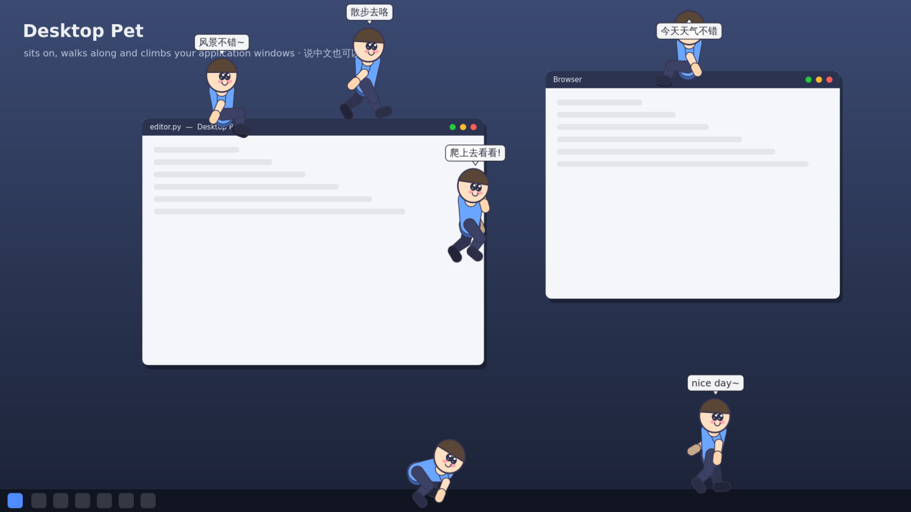

<div align="center">


# Desktop Pet

**A highly interactive, fully customizable desktop companion for Windows.**

Your pet is rigged from real *body sections*, so it doesn't just slide around —
it **walks, runs, climbs your windows, creeps along ledges, sits on title bars,
sleeps, and can be grabbed and thrown**. Bring your own character (a person, an
animal, a blob — any PNG) and it gets cut into parts and animated automatically.



</div>

---

## ✨ Features

- 🦴 **Skeletal body-section rig.** Characters are decomposed into head, torso,
  arms, forearms, hands, thighs, shins and feet, connected by joints. Actions
  are driven by forward kinematics and **inverse kinematics** (so hands actually
  reach for and grip window edges while climbing).
- 🧗 **Real window interaction.** The pet treats your open application windows
  and the taskbar as a playground — it **stands and walks on title bars**,
  **climbs window sides and screen edges**, **sits on ledges**, and **falls**
  when you drag a window out from under it.
- 🐛 **Lots of actions:** idle, walk, run, **creep/crawl**, **climb**, sit
  (legs dangling), sleep, wave, cheer, chase the cursor, and get dragged &
  thrown with real momentum.
- 🎨 **Bring any character.** Drop in a PNG and Desktop Pet extracts the body
  parts for you (`auto_humanoid` heuristic, explicit `regions`, or optional
  **MediaPipe pose** detection). No art? The built-in mascot is drawn
  procedurally from shapes and works instantly.
- 🛠️ **Highly customizable.** Size, opacity, frame rate, gravity, per-action
  speeds, which behaviours are allowed, autonomy pacing, number of pets, window
  interaction, follow-cursor, speech bubbles — all from a settings dialog or
  `config.json`. The **shape and skeleton** are data too (`character.json`).
- 🐾 **Classic desktop-pet extras:** multiple pets at once, right-click menu &
  system-tray control, **drag-and-throw**, **poke to react**, Tamagotchi-style
  hunger/energy/happiness stats with **feeding**, speech bubbles, multi-monitor
  support, and **start-at-login**.
- 📦 **Ships as a real app:** a standalone `DesktopPet.exe` and a Windows
  installer, built reproducibly in CI.

## 🚀 Getting started

### Option A — download the executable (easiest)

1. Grab `DesktopPet.exe` (or `DesktopPet-Setup.exe`) from the
   [**Releases**](https://github.com/evergarden0101/desktop-pet/releases) page,
   or from the artifacts of the latest
   [**build workflow**](https://github.com/evergarden0101/desktop-pet/actions).
2. Double-click it. A little pet appears at the bottom of your screen and a
   Desktop Pet icon appears in your system tray.

> The exe is produced on a Windows CI runner (see *Building* below) — you can
> also build it yourself in one command.

### Option B — run from source

Requires **Python 3.9+**.

```bash
git clone https://github.com/evergarden0101/desktop-pet
cd desktop-pet
pip install -r requirements.txt
python run.py
```

## 🎮 Using your pet

| Action | Result |
| --- | --- |
| **Left-click** the pet | Poke it — it waves back |
| **Left-drag** | Pick it up; **release to throw** (momentum carries) |
| **Right-click** the pet | Context menu: actions, size, character, feed, settings… |
| **Tray icon** | Same menu; double-click to make all pets wave |

From the menu you can make it **climb the nearest edge**, **creep**, **sit**,
**sleep**, follow the cursor, add more pets, change size/character, and open
**Settings**. Left to its own devices, the pet's *autonomy brain* wanders,
climbs nearby windows, naps when tired, and generally lives on your desktop.

## 🧩 Customization

### Settings

Open **Settings** from the menu, or edit the JSON directly at
`%APPDATA%\DesktopPet\config.json`. Highlights:

| Setting | Meaning |
| --- | --- |
| `scale`, `opacity`, `fps` | Size, transparency, smoothness |
| `gravity_enabled` | Turn gravity/throwing on or off |
| `walk/run/climb/creep_speed` | Per-action movement speeds |
| `interact_with_windows` | Walk on / climb application windows |
| `follow_cursor` | Pet chases your mouse |
| `enabled_behaviors` | Which actions the autonomy brain may choose |
| `pet_count` | How many pets to spawn |
| `autonomy_min/max` | How restless the pet is (seconds between actions) |
| `start_on_login` | Launch automatically at login |

### Bring your own character

Any image works. Cut it into body parts and register it as a character:

```bash
# Make a character named "Hero" from hero.png (transparent PNG works best)
python run.py extract hero.png --name Hero
python run.py run --character Hero
```

Extraction strategies (`--method`):

- `auto_humanoid` *(default)* — slices an upright, front-facing figure into
  standard proportions. Zero extra dependencies.
- `regions` — you specify exact rectangles per part in `character.json`
  (pixel-perfect; best for hand-authored characters).
- `pose` — uses **MediaPipe** pose landmarks if installed
  (`pip install mediapipe numpy`); falls back to `auto_humanoid` otherwise.

A character is just a folder with a `character.json` (skeleton, part regions,
pose overrides, render palette). The full format — including how to define a
non-humanoid shape — is documented in **[docs/characters.md](docs/characters.md)**.

You can also generate a demo character to see how packs are structured:

```bash
python tools/make_sample_character.py --out mascot.png
python run.py extract mascot.png --name Mascot
```

## 🏗️ Building the executable & installer

On **Windows**, with Python on your PATH:

```bat
build.bat              :: -> dist\DesktopPet.exe   (standalone, no install)
build.bat installer    :: -> dist\DesktopPet-Setup.exe  (needs Inno Setup)
```

`build.bat` creates a virtualenv, installs dependencies + PyInstaller, generates
the icon, and freezes the app using `packaging/DesktopPet.spec`. The installer
step uses `packaging/installer.iss` (install [Inno Setup](https://jrsoftware.org/isdl.php)
and re-run with `installer`).

**CI** (`.github/workflows/build.yml`) does all of this automatically: it runs
the tests on Linux and builds & uploads `DesktopPet.exe` (and the installer) on
a Windows runner on every push; tagging a release (`vX.Y.Z`) attaches them to a
GitHub Release.

## 🧪 Development & tests

The simulation core is deliberately GUI-free, so most of it is unit-tested
headlessly; the PySide6 layer is covered by offscreen smoke tests.

```bash
QT_QPA_PLATFORM=offscreen pytest -q
```

Architecture, invariants and extension points are documented in
**[CLAUDE.md](CLAUDE.md)**.

## 🩹 Troubleshooting

- **Nothing appears after launch.** Fixed in v1.0.1 for displays using Windows
  scaling (125 %/150 %…) — update if you're on 1.0.0. If pets ever get lost
  (monitor unplugged, resolution changed), **double-click the tray icon** or
  choose **Summon pets** from its menu to drop them back onto the main screen.
- **The pet ignores my windows.** Enable *“Walk on and climb application
  windows”* in Settings (`interact_with_windows`). Some windows (elevated/admin
  apps) can't be introspected without matching privileges.
- **Clicks go “through” the pet or it won't grab.** The overlay is click-through
  except over the pet; make sure you're clicking on the body.
- **`PySide6` import errors on Linux** (dev only): install the Qt runtime libs,
  e.g. `sudo apt-get install libegl1 libgl1 libxkbcommon0 libdbus-1-3`.
- **Non-Windows dev:** run with `--backend null` to use the synthetic desktop.

## 📁 Project layout

```
src/desktop_pet/    core simulation, rig, behaviours, platform backends, UI
assets/characters/  bundled character packs (default = "Pip", shapes mode)
packaging/          PyInstaller spec, Inno Setup script, icon generator
tools/              helper scripts (sample character generator)
tests/              headless engine tests + offscreen UI smoke tests
```

## 📜 License

MIT — see [LICENSE](LICENSE). Bring your own character art responsibly; you're
responsible for the images you import.
