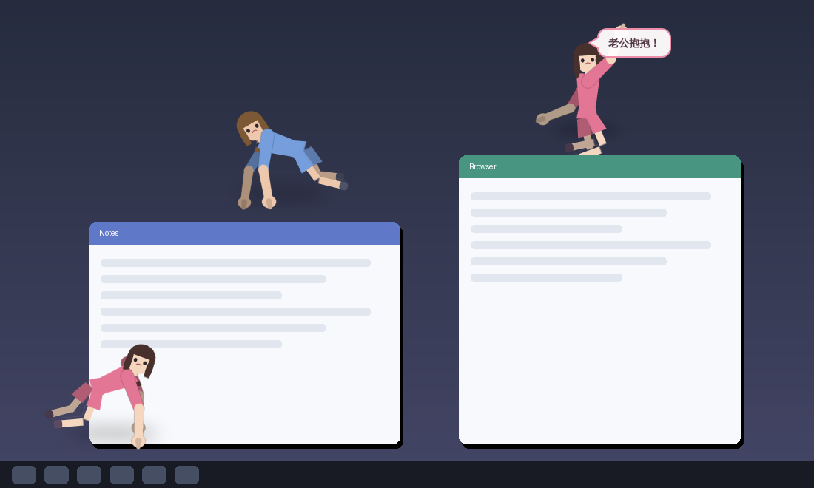

# Desktop Pet

Extracts the people out of one image and turns them into desktop pets that
crawl around your screen, climb on your windows, and answer when you call.



*(The preview uses the built-in placeholder figures — replace them with your
own image, see step 1.)*

- Each figure keeps its **own face, hairstyle and clothing** — those pixels are
  never repainted, only sliced and rotated at the joints.
- Arms and hands are **drawn in**, because a standing photo does not show what
  the hands do while crawling. They are painted in skin and clothing colours
  sampled from that same figure.
- Backgrounds, props and any small blobs are dropped during extraction.
- Pets crawl along the **bottom of the screen and the top edge of every open
  window**, climb low window edges, turn back at tall ones, and fall when they
  crawl off a ledge.
- Right-click any pet → **Call Husband** (喊老公) pops a speech bubble beside
  her head. The other pets answer a moment later.

## Quick start

```bash
pip install -r requirements.txt

python tools/make_demo_figures.py   # placeholder figures, so you can try it now
python tools/make_frames.py         # build the animation frames
python run.py                       # run it
```

## 1. Use your own image

Put your image anywhere and run:

```bash
pip install rembg onnxruntime          # strongly recommended for photos
python tools/extract_figures.py path/to/your-image.jpg
python tools/make_frames.py
python run.py
```

`extract_figures.py` removes the background, splits the remaining mask into one
blob per person, drops everything too small or too wide to be a person, and
writes `assets/pets/figure_01/base.png`, `figure_02/…` and so on.

Delete the `assets/pets/demo_*` folders once you have your own figures, or the
demos will show up alongside them.

**Best results come from a full-body image** — head to feet, figures not
overlapping. The rig locates the neck, waist and knees from the silhouette, so
a portrait crop that stops at the waist has no legs to animate.

If two people are touching, the automatic split will merge them into one blob.
Separate them by hand with pixel boxes:

```bash
python tools/extract_figures.py photo.jpg --boxes 10,20,300,900 320,40,610,900
```

Other useful flags:

| Flag | Meaning |
| --- | --- |
| `--no-rembg` | skip the ML matting, use the border flood fill |
| `--min-area 0.002` | keep smaller blobs (use if a figure went missing) |
| `--max-figures 3` | keep only the largest N people |
| `--height 480` | cutout resolution before scaling |

## 2. Build the .exe

On **Windows**:

```bash
pip install -r requirements.txt pyinstaller
python build_exe.py            # --onedir starts faster, --onefile is tidier
```

The result is `dist/DesktopPet.exe`. Double-click it — no Python needed on the
machine you run it on.

Without a Windows machine, push this branch and GitHub Actions builds it for
you: **Actions → Build Windows exe → Run workflow**, then download the
`DesktopPet-windows` artifact. PyInstaller cannot cross-compile, so a Linux or
macOS build produces a binary for *that* platform, not a `.exe`.

To swap figures **after** building, drop an `assets/` folder next to the exe —
it is preferred over the copy bundled inside, so no rebuild is needed.

## Controls

| Action | Result |
| --- | --- |
| Right-click a pet | menu: Call Husband, Head Pat, Come Here, Pause, One More, Quit |
| **Call Husband** | speech bubble beside her head; the others answer |
| Double-click | same as Call Husband |
| Left-drag | pick her up; let go and she falls to the nearest surface |
| Tray icon | same menu, and the reliable way to quit |

Menus and bubbles follow your system language (Chinese or English). Force it
with `python run.py --lang zh` or `--lang en`.

## Tuning

`assets/config.json` (or `desktop_pet.json` next to the exe) overrides any
field in `Config`:

```json
{ "scale": 0.42, "speed": 62.0, "max_pets": 8, "language": "auto" }
```

| Key | Meaning |
| --- | --- |
| `scale` | sprite size relative to the generated frames |
| `speed` | crawl speed in pixels per second |
| `climb_height` | how tall a window edge she will climb, as a fraction of her height |
| `play_chance` | chance per tick that she stops to play |
| `obey_window_edges` | `false` = ignore windows, crawl on the desktop floor only |

Command line: `--scale`, `--count`, `--lang`, `--no-window-edges`, `--pets DIR`.

## How the crawl is generated

`tools/make_frames.py` never repaints the figure. For each cutout it:

1. Reads the alpha silhouette and finds the **neck** and **waist** as the
   narrowest rows in the upper third and the middle, then derives shoulders
   and knees from those.
2. Samples **skin** colour from the lower-central head (cheeks and chin, dark
   hair pixels excluded) and **clothing** colour from the upper torso.
3. Slices the cutout into head / torso / thigh / shin layers with a feathered
   cut so the seams disappear once the pieces move.
4. Rotates each layer about its joint into a crawling pose, and draws two arms
   ending in hands — one behind the body and dimmed, one in front — swinging a
   half-cycle apart from the legs.
5. Crops every frame of every animation to one shared box, so the ground
   contact line is always the bottom edge of the frame and she never jitters
   when the animation changes.

`meta.json` records the head position for every frame, which is how the speech
bubble knows where to point.

## Windows and other platforms

Window-edge terrain is Win32-only (`EnumWindows`, skipping cloaked, minimised
and tool windows). On Linux and macOS everything still runs — the pets just
have the desktop floor to themselves, which is what makes the app testable
outside Windows.

## Tests

```bash
QT_QPA_PLATFORM=offscreen python tests/test_physics.py
```

Covers ledge and wall detection, climbing, falling, landing on window tops,
staying on screen, and the speech bubble anchoring to the head.

## Layout

```
tools/extract_figures.py      image -> one transparent cutout per person
tools/make_frames.py          cutout -> crawl + play frames and meta.json
tools/make_demo_figures.py    placeholder figures
tools/rig.py                  joint finding, colour sampling, limb drawing
src/desktop_pet/pet.py        one pet: physics, dragging, right-click menu
src/desktop_pet/obstacles.py  windows -> ledges and walls
src/desktop_pet/bubble.py     the speech bubble
src/desktop_pet/app.py        spawning, the clock, the tray icon
build_exe.py                  PyInstaller packaging
```
